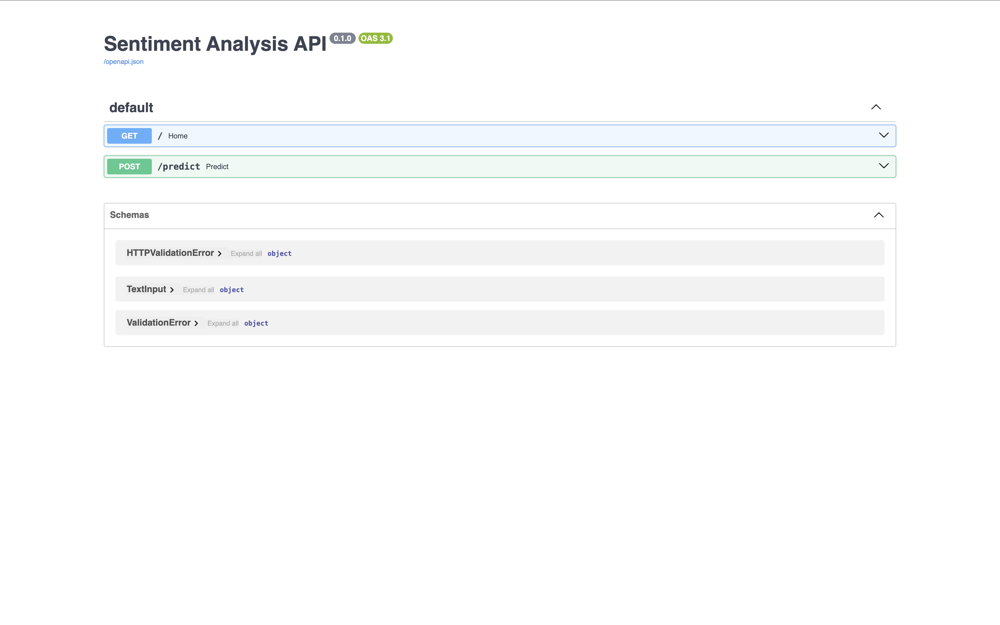

# Sentiment Analysis API (FastAPI + Docker + CI/CD + Deployed)

A production-style machine learning service: a trained sentiment-analysis model served through a **FastAPI** REST API, packaged with **Docker**, tested and validated automatically with a **CI/CD pipeline** (GitHub Actions), and **deployed live**.

This project focuses on the *engineering around* a model — turning a trained model into a real, tested, containerized, deployed service — which is the core of an ML/MLOps engineering role.

**Live demo:** https://sentiment-api-mc4f.onrender.com/docs

*(Note: the free hosting tier sleeps after inactivity, so the first request may take ~30–60 seconds to wake the service.)*



## What it does

Send a piece of text to the API and it returns the predicted sentiment (positive, negative, or neutral), using a model trained on labeled airline tweets.

```
POST /predict
{ "text": "My flight was delayed and the staff was rude" }

Response:
{ "text": "My flight was delayed and the staff was rude", "sentiment": "negative" }
```

## Architecture

```
        Client (browser, app, or another service)
                        │  HTTP request
                        ▼
             ┌────────────────────┐
             │   FastAPI service  │   <- REST API (main.py)
             │   /predict endpoint│
             └─────────┬──────────┘
                       │ loads
             ┌─────────▼──────────┐
             │  Trained ML model  │   <- scikit-learn model + vectorizer
             │  (model.pkl)       │
             └────────────────────┘

  Packaged in a Docker container ──> deployed to Render (live URL)
  Every git push ──> GitHub Actions runs the tests automatically (CI)
                 ──> Render auto-redeploys the new version (CD)
```

## Tech stack

- **FastAPI** — the REST API framework, with automatic interactive docs (Swagger).
- **Pydantic** — validates incoming requests (rejects malformed input automatically).
- **scikit-learn** — the trained sentiment model (TF-IDF + Logistic Regression).
- **pytest** — automated test suite.
- **Docker** — containerizes the app so it runs identically anywhere.
- **GitHub Actions** — CI pipeline that runs the tests on every push.
- **Render** — hosts the live service, auto-deploying on every push (CD).

## Project structure

```
sentiment-api/
├── main.py             # FastAPI app: loads the model, serves /predict
├── test_main.py        # automated tests (pytest)
├── Dockerfile          # recipe to build the container
├── requirements.txt
├── model.pkl           # trained classifier
├── vectorizer.pkl      # TF-IDF vectorizer
└── .github/workflows/  # CI pipeline (runs tests on every push)
```

## Running locally

```bash
pip install -r requirements.txt
uvicorn main:app --reload
```

Then open http://127.0.0.1:8000/docs to try the API interactively.

## Running with Docker

```bash
docker build -t sentiment-api .
docker run -p 8000:8000 sentiment-api
```

The app is then available at http://127.0.0.1:8000/docs — running fully inside a container, with no local Python setup needed.

## Testing

```bash
pytest -v
```

The suite checks the home endpoint, the model's predictions, and that malformed input is correctly rejected (input validation).

## CI/CD

- **CI:** a GitHub Actions workflow (`.github/workflows/`) runs the full test suite automatically on every push and pull request, in a clean Linux environment. A change that breaks the API is caught immediately.
- **CD:** Render is connected to the repo and automatically rebuilds and redeploys the service whenever new code is pushed.

## How the model was built

The sentiment model comes from a companion project where a TF-IDF + Logistic Regression classifier was trained on ~14,600 labeled airline tweets, improving accuracy from a ~56% VADER baseline to ~75%. This project takes that trained model and turns it into a deployed service.

## Limitations & future work

- The free hosting tier sleeps when idle, so the first request after inactivity is slow to respond.
- The model reflects its airline-tweet training data.
- Possible extensions: add request logging and monitoring, a `/health` endpoint, rate limiting, and model versioning.
